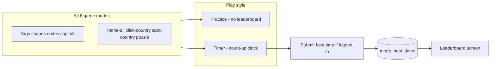
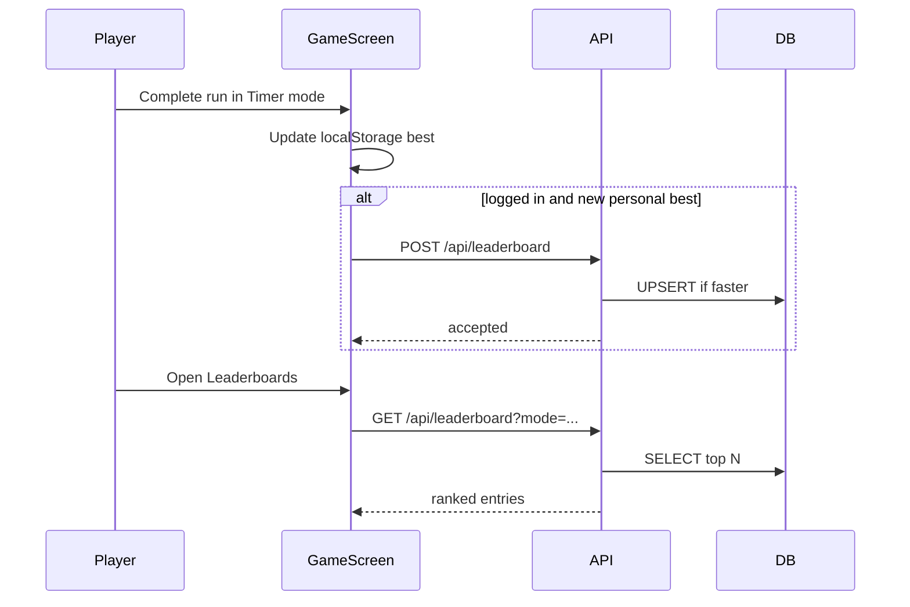

# Leaderboard Strategy for Locato

## Current state

| Area | Today |
|------|--------|
| **Map modes** (`name-all`, `click-country`, `spot-country`, `puzzle`) | Practice/Timer toggle exists in [`CountryGuessingScreen.ts`](src/ui/screens/CountryGuessingScreen.ts); best times stored in `localStorage` only |
| **Prompt modes** (`flags`, `shapes`, `codes`, `capitals`) | Score/streak only in [`SoloGameScreen.ts`](src/ui/screens/SoloGameScreen.ts) + [`GameEngine.ts`](src/core/game/GameEngine.ts); no timer |
| **Auth** | Cookie sessions, SQLite via [`database.ts`](server/db/database.ts) |
| **Server stats** | `user_stats` aggregates multiplayer totals via `POST /api/games`; no per-mode records |

## Target model

Every game mode gets two play styles:



**Leaderboard rule (uniform):** rank users by **fastest completion time** in **timer mode** only. Practice runs never submit.

**Completion definitions (unchanged):**

- Prompt modes: all countries in the deck guessed (`GAME_COMPLETED` in `GameEngine`)
- Map typing/click modes: all ~195 countries found
- Puzzle: all pieces placed + first accuracy check (timer already stops here)

**Puzzle variant:** leaderboard key includes **continent** (`Africa`, `Asia`, etc.) because country counts differ. All other modes use an empty variant.

---

## Data model

Add one SQLite table in [`server/db/database.ts`](server/db/database.ts):

```sql
CREATE TABLE mode_best_times (
  user_id     TEXT NOT NULL REFERENCES users(id) ON DELETE CASCADE,
  game_mode   TEXT NOT NULL,   -- GameModeId
  variant     TEXT NOT NULL DEFAULT '',  -- '' or continent for puzzle
  best_time_ms INTEGER NOT NULL,
  achieved_at  INTEGER NOT NULL,
  PRIMARY KEY (user_id, game_mode, variant)
);

CREATE INDEX mode_best_times_rank
  ON mode_best_times (game_mode, variant, best_time_ms ASC, achieved_at ASC);
```

**Why one row per user/mode/variant:** keeps reads fast (top-N is a single indexed query) and matches existing local “best time” semantics.

Extend [`UserStore`](server/auth/types.ts) with:

- `submitBestTime(userId, { gameMode, variant, timeMs, achievedAt })` — insert or update only if `timeMs` is strictly better; return `{ accepted, isPersonalBest, stats }`
- `getLeaderboard({ gameMode, variant, limit, offset })` — join `users` for `displayName`, `avatarEmoji`
- `getUserRank(userId, gameMode, variant)` — optional, for “you are #42”

**Validation on submit:**

- Auth required
- `gameMode` must be a known [`GameModeId`](src/core/gameModes.ts)
- `timeMs` integer, e.g. 5_000–7_200_000 (5s–2h sanity bounds)
- `variant` required for `puzzle`, must be a valid continent; empty for others
- Basic rate limit (e.g. max 10 submits/min/user) to reduce spam

No attempt history in v1 — add a `mode_attempts` table later if you want “recent runs” or anti-cheat replay.

---

## API

Add routes in [`server/auth/routes.ts`](server/auth/routes.ts) (or a small `server/leaderboard/routes.ts`):

| Method | Path | Auth | Purpose |
|--------|------|------|---------|
| `GET` | `/api/leaderboard?mode=name-all&variant=&limit=50&offset=0` | Optional | Top entries + optional `currentUser` rank when logged in |
| `POST` | `/api/leaderboard` | Required | Body: `{ gameMode, variant?, timeMs }` |

**GET response shape:**

```ts
{
  entries: Array<{
    rank: number;
    userId: string;
    displayName: string;
    avatarEmoji: string | null;
    timeMs: number;
    achievedAt: number;
  }>;
  currentUser?: { rank: number; timeMs: number } | null;
}
```

Client wrapper in [`src/core/auth/index.ts`](src/core/auth/index.ts): `fetchLeaderboard(...)`, `submitBestTime(...)`.

---

## Client: shared timer module

Extract timer logic duplicated today in [`CountryGuessingScreen.ts`](src/ui/screens/CountryGuessingScreen.ts) into something like [`src/core/timer/playTimer.ts`](src/core/timer/playTimer.ts):

- `createPlayTimer({ storage, keys, onTick })`
- Modes: `"off" | "count-up"`
- `startOnFirstAction()`, `stop()`, `reset()`, `readBest()`, `writeCompletion(timeMs)`
- Per-mode `localStorage` keys (same keys map modes already use; add keys for prompt modes)

Both game screens import this instead of inline timer code.

---

## Client: prompt game timer mode (new)

In [`SoloGameScreen.ts`](src/ui/screens/SoloGameScreen.ts):

1. Add Practice/Timer `<select>` matching map UI (reuse CSS from country-guessing stats panel).
2. Start timer on first `GUESS_CORRECT` event; stop on `GAME_COMPLETED`.
3. Show Time / Previous / Best cards when timer is active (mirror map layout).
4. On completion in timer mode: persist local best, then call `submitBestTime` if authenticated.

[`GameEngine`](src/core/game/GameEngine.ts) stays pure — timer is UI concern, same as map modes.

**Timer keys (example):**

- `locato:solo:flags:timer-best-ms:v1`, etc. for each `PromptGameModeId`

---

## Client: map mode server sync

In [`CountryGuessingScreen.ts`](src/ui/screens/CountryGuessingScreen.ts), after `updateStoredTimerTimesForCurrentMode` returns `isNewBest`:

```ts
if (isNewBest && authUser) {
  void submitBestTime({
    gameMode: playMode,
    variant: playMode === "puzzle" ? puzzleContinent : "",
    timeMs: finalTimeMs,
  });
}
```

Pass `authUser` (or a callback) from [`App.ts`](src/app/App.ts) the same way multiplayer already uses auth.

Guests: keep local best times; optionally show “Sign in to post your time” on new personal best.

---

## Leaderboard UI

Add route + screen:

- Extend [`AppRoute`](src/app/router.ts): `{ type: "leaderboard"; mode?: GameModeId; variant?: string }`
- New [`LeaderboardScreen.ts`](src/ui/screens/LeaderboardScreen.ts)
- Entry points:
  - “Leaderboards” link in header / auth area (near existing controls in [`AuthPanel.ts`](src/ui/components/AuthPanel.ts) or game mode dropdown)
  - “View leaderboard” CTA after timer completion

**Screen behavior:**

- Mode picker: all 8 modes from [`gameModes.ts`](src/core/gameModes.ts)
- Continent picker when `mode === "puzzle"`
- Table: rank, avatar, display name, time (reuse formatting from `formatElapsedTime`)
- Highlight current user row; show “Your best: —” + sign-in prompt if guest
- Reuse multiplayer leaderboard row styling from [`multiplayer.css`](src/styles/multiplayer.css) where possible



---

## Ranking and display rules

| Mode group | Leaderboard boards | Metric | Sort |
|------------|-------------------|--------|------|
| `flags`, `shapes`, `codes`, `capitals` | 1 per mode | Completion time (ms) | Ascending (faster wins) |
| `name-all`, `click-country`, `spot-country` | 1 per mode | Completion time (ms) | Ascending |
| `puzzle` | 1 per continent | Completion time (ms) | Ascending |

**Tie-break:** earlier `achieved_at` ranks higher.

**Not in scope for v1:** multiplayer room scores, practice-mode runs, accuracy-based puzzle ranking (time-only keeps rules simple and consistent).

---

## Implementation phases

### Phase 1 — Server foundation
- Migration + `UserStore` methods + memory store parity in [`memoryStore.ts`](server/auth/memoryStore.ts)
- `GET`/`POST` leaderboard routes + tests in [`tests/auth.test.ts`](tests/auth.test.ts) (or new `leaderboard.test.ts`)
- Client fetch helpers

### Phase 2 — Map modes (timer already exists)
- Extract shared `playTimer` module; refactor `CountryGuessingScreen` to use it
- Wire `submitBestTime` on new local best
- Basic leaderboard screen for map modes only (validates end-to-end)

### Phase 3 — Prompt timer modes
- Add Practice/Timer UI + timer lifecycle to `SoloGameScreen`
- Wire submission + enable all modes in leaderboard picker

### Phase 4 — Polish
- Post-completion “View leaderboard” link
- Guest sign-in nudge on personal best
- Empty states, loading/error handling

---

## Risks and future work

- **Client-reported times** can be cheated in v1. Mitigations: sanity bounds, rate limits, login required. Longer term: server-authoritative runs or signed completion tokens.
- **SQLite on Fly.io** is fine for early leaderboards; [`FLY_IO_PLAN.md`](FLY_IO_PLAN.md) already notes Postgres if traffic grows.
- **Existing local bests** are not migrated automatically; first server record is set on the user’s next logged-in timer completion.
